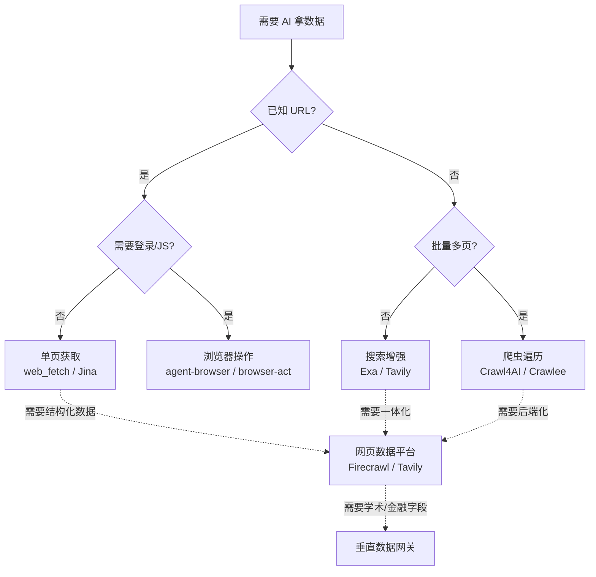

做 AI Agent 项目最大的坑不是 prompt，而是**怎么让 agent 拿到正确的数据**。同一个目标——"读完这篇文章"——用对的工具可能 200ms + 几美分，用错的工具可能 30 秒 + 几块钱。这篇是我整理的工具分类与决策框架。

## 一、六类工具，一句话区分

按"轻 → 重"排列，遇到问题逐级升级：

| 类别 | 解决什么 | 轻的代表 | 重的代表 |
|---|---|---|---|
| **单页获取** | 已知 URL，拿正文 | `web_fetch`、Jina Reader | — |
| **搜索增强** | 不知道 URL，先搜来源 | Exa Search、Tavily Search | 内置 web search |
| **浏览器操作** | 登录、点击、JS 渲染 | `agent-browser` | `browser-act`、Stagehand |
| **爬虫与遍历** | 从入口批量抓整站 | Crawl4AI、Crawlee | AnyCrawl |
| **网页数据平台** | search+scrape+crawl 统一 API | Tavily | Firecrawl |
| **垂直数据网关** | 不抓网页，直接接结构化数据 | 学术 / 金融 / 企业 API SDK | `agent-gw` 类聚合 |

核心原则：**先用最轻的能力，只有不够时才升级**。90% 的需求 `web_fetch` + Exa/Tavily 就能解决，剩下 10% 才是爬虫和浏览器的战场。

## 二、决策流程图



## 三、关键工具横评

### 3.1 单页获取（最轻）

| 工具 | 强项 | 弱项 | npm 包 | API key |
|---|---|---|---|---|
| `web_fetch` | 最快、最便宜 | 不处理复杂前端 | — | — |
| Jina Reader | 极简 URL→文本 | 不是完整搜索体系 | — | 免费 1000 次/日 |
| Exa Contents | 跟 Exa 搜索闭环 | 依赖 Exa 体系 | `exa-js` | $5/月起 |
| Tavily Extract | 跟 Tavily 工作流串联 | 偏平台化 | `@tavily/core` | $0.001/次 |

**推荐**：

- 已知 URL → 先试 `web_fetch`
- 极简 URL → Jina Reader
- 已在 Exa 体系 → Exa Contents
- 已在 Tavily 体系 → Tavily Extract

### 3.2 浏览器操作（最重）

| 工具 | 控制对象 | 强项 | 何时选 | API key |
|---|---|---|---|---|
| Kimi WebBridge | **你真实的浏览器** | 复用真实登录态 | 你已登录想复用状态 | 免费 |
| `agent-browser` | 自动化 Chromium | 简洁、适合页面交互 | 标准点击 / 输入 / 截图 | — |
| `browser-act` | 自起浏览器 + 直连 Chrome | stealth、代理、验证码 | 复杂自动化 / 反爬 | — |
| `browser-use` | 浏览器 agent 框架 | 让 LLM 自主操作 | agent 编排 | 开源 |
| Stagehand | Browserbase SDK | 适合集成到产品 | 嵌入产品 | 需 Browserbase 账号 |

**经验法则**：

- **已登录** → Kimi WebBridge
- **要自动化 + stealth** → `browser-act`
- **给 agent 用** → `browser-use` / Stagehand
- **做测试** → Playwright

### 3.3 爬虫与遍历

| 工具 | 生态 | 强项 | 何时选 | 包 |
|---|---|---|---|---|
| Crawl4AI | Python | Markdown、RAG 清洗 | Python + RAG 管道 | `crawl4ai` |
| Crawlee | Node.js | 复杂调度 + 反爬 | Node.js 工程抓取 | `crawlee` |
| ScrapeGraphAI | Python | AI 驱动提取 | Python + LLM 提取 | `scrapegraphai` |
| AnyCrawl | Node.js | 服务化抓取 | 团队抓取后端 | 需部署 |

**安装示例**：

```bash
# Crawl4AI
pip install crawl4ai
crawl4ai-setup  # 装浏览器

# Crawlee
npm install crawlee
```

### 3.4 网页数据平台（一体化）

| 工具 | 核心定位 | 强项 | 何时选 | API key |
|---|---|---|---|---|
| Tavily | Agent research API | search→extract→crawl 闭环 | Agent 调研 | $0.001/次 |
| Firecrawl | 完整数据平台 | search/scrape/crawl/interact | 想要统一平台 | $0.005/页 |
| AnyCrawl | 自托管抓取 | 服务化部署 | 团队共用后端 | 自部署 |

## 四、6 大工具安装与使用

### 4.1 web_fetch（内建）

```bash
# 无需安装，HTTP 客户端直接实现
curl -s "https://r.jina.ai/https://example.com" | head
```

### 4.2 Jina Reader

```bash
# 浏览器扩展 + API
curl "https://r.jina.ai/https://blog.example.com/post-1"

# Node.js SDK
npm install jinaai
```

```js
import { JinaReader } from 'jinaai'
const reader = new JinaReader({ apiKey: process.env.JINA_API_KEY })
const result = await reader.read('https://example.com')
```

### 4.3 Exa

```bash
npm install exa-js
```

```js
import Exa from 'exa-js'
const exa = new Exa(process.env.EXA_API_KEY)

// 搜索
const results = await exa.search('latest AI agent frameworks', {
  numResults: 5,
  useAutoprompt: true
})

// 拿内容
const contents = await exa.getContents(['https://example.com/post'])
```

### 4.4 Tavily

```bash
npm install @tavily/core
```

```js
import { tavily } from '@tavily/core'

// 搜索
const result = await tavily.search('AI agent tools comparison', {
  maxResults: 5,
  includeAnswer: true
})

// extract
const extract = await tavily.extract(['https://example.com/article'])

// crawl（整站）
const crawl = await tavily.crawl('https://docs.example.com', {
  maxDepth: 2
})
```

### 4.5 Firecrawl

```bash
# 云端 API（最简单）
curl -X POST https://api.firecrawl.dev/v1/scrape \
  -H "Authorization: Bearer fc-xxx" \
  -d '{"url": "https://example.com"}'

# 自部署
docker run -d --name firecrawl -p 3002:3002 firecrawl/firecrawl
```

```js
import FirecrawlApp from '@mendable/firecrawl-js'
const app = new FirecrawlApp({ apiKey: 'fc-xxx' })

// 单页抓取
const result = await app.scrapeUrl('https://example.com')

// 整站爬取
const crawlResult = await app.crawlUrl('https://docs.example.com', {
  limit: 100,
  maxDepth: 3
})
```

### 4.6 Crawl4AI（Python）

```bash
pip install crawl4ai
crawl4ai-setup
```

```python
import asyncio
from crawl4ai import AsyncWebCrawler

async def main():
    async with AsyncWebCrawler() as crawler:
        result = await crawler.arun(
            url="https://example.com",
            word_count_threshold=10,
            extraction_strategy="llm"
        )
        print(result.markdown[:500])

asyncio.run(main())
```

## 五、10 条默认推荐

没特殊约束时的选择顺序：

1. **已知 URL**：先试 `web_fetch`，不行换 Jina
2. **查技术资料 / 英文**：Exa
3. **Agent 调研工作流**：Tavily（search→extract→crawl）
4. **登录态页面**：Kimi WebBridge（用你的真实浏览器）
5. **复杂自动化 / 反爬**：`browser-act`
6. **Python + RAG 清洗**：Crawl4AI
7. **Node.js 工程抓取**：Crawlee
8. **团队统一抓取后端**：AnyCrawl
9. **完整数据平台**：Firecrawl
10. **学术 / 金融 / 企业数据**：用垂直 API（`agent-gw` 这类）

## 六、4 类典型场景的最佳实践

### 6.1 内容聚合（AI 早报）

```js
// Tavily 搜索最近 24h 的 AI 新闻
const news = await tavily.search('AI news latest', {
  maxResults: 10,
  topic: 'news',
  days: 1
})
// 用 LLM 摘要
const summary = await llm.summarize(news.results)
```

### 6.2 RAG 数据准备

```python
# Crawl4AI 批量抓取文档站
urls = ["https://docs.example.com/page1", ...]
for url in urls:
    result = await crawler.arun(url=url)
    # 转 markdown 存入向量库
    chunks = text_splitter.split(result.markdown)
    vector_store.add(chunks)
```

### 6.3 竞品监控

```bash
# 每周跑一次 Tavily crawl
tavily.crawl('https://competitor.com/blog', {
  maxDepth: 2,
  limit: 50
})
# 对比新增内容，告警
```

### 6.4 私域数据接入

```python
# 用 agent-gw 接企业内部 API
from agent_gw import Gateway
gw = Gateway(credentials={...})
data = gw.query("SELECT * FROM customers WHERE ...")
```

## 七、决策原则（避坑指南）

### 7.1 何时用哪个

| 场景 | 选错工具的后果 | 正确选择 |
|---|---|---|
| 已知 URL，5 秒要结果 | 用爬虫浪费 30 秒 | `web_fetch` |
| 整站要 1000 页 | 用浏览器卡到崩 | Crawl4AI / Crawlee |
| 登录后才能看 | 用抓取器 403 | Kimi WebBridge |
| 复杂前端 SPA | `curl` 拿不到内容 | `browser-use` |
| 反爬严格 | 普通 HTTP 被 ban | `browser-act` + 代理 |
| 实时数据 | 缓存过期 | 垂直数据网关 |

### 7.2 常见误区

- **过度爬取**：能 API 解决的别爬，**爬取有法律风险**
- **存原始 HTML**：转 Markdown 后再存，**省 10 倍空间**
- **同步抓取**：用异步 / 队列，**吞吐高 10 倍**
- **不设超时**：默认 30 秒超时，**避免永久卡住**
- **robots.txt 忽略**：**先看 robots.txt**！可能违法

### 7.3 合规红线

```text
绝对不能爬的：
- 个人信息（GDPR / 个保法）
- 受版权保护的内容（除非合理使用）
- robots.txt 明确禁止的
- 需要登录的页面（未经授权）
- 反爬机制强的站（可能触发法律纠纷）
```

**原则**：能 API 走 API，能 RSS 走 RSS，**不能爬就用浏览器手动**。

## 八、性能优化

### 缓存层

```js
// 用 Redis 缓存抓取结果
const cached = await redis.get(`url:${hash(url)}`)
if (cached) return cached

const result = await fetch(url)
await redis.set(`url:${hash(url)}`, result, 'EX', 86400)  // 缓存 24h
```

### 并发控制

```python
# 用 semaphore 控制并发
sem = asyncio.Semaphore(5)  # 最多 5 个并发

async def fetch(url):
    async with sem:
        return await crawler.arun(url)
```

### 增量抓取

```js
// 只抓新内容（用 sitemap + lastmod）
const sitemap = await fetch('https://example.com/sitemap.xml')
const urls = parseSitemap(sitemap).filter(u => 
  new Date(u.lastmod) > lastCrawlTime
)
```

## 九、5 个最易踩的坑

1. **robots.txt 没看**——直接爬被 ban
2. **没设 User-Agent**——被服务器识别为 bot 拒绝
3. **没设 rate limit**——同一 IP 频繁请求被临时 ban
4. **JS 渲染页面用 curl**——拿不到动态内容
5. **大文件下载不限制**——一个 PDF 1 GB 把磁盘撑爆

## 十、对比矩阵速查

| 工具 | 类型 | 价格 | 学习曲线 | 适合 |
|---|---|---|---|---|
| `web_fetch` | 单页 | 免费 | 0 | 已知 URL |
| Jina Reader | 单页 | 免费 1k/日 | 0 | 极简 |
| Exa Search | 搜索 | $5/月起 | 低 | 英文技术 |
| Tavily Search | 搜索 | $0.001/次 | 低 | Agent 调研 |
| Kimi WebBridge | 浏览器 | 免费 | 低 | 已登录 |
| `browser-act` | 浏览器 | 免费 | 中 | 反爬自动化 |
| `browser-use` | 浏览器 agent | 开源 | 中 | Agent 框架 |
| Crawl4AI | 爬虫 | 开源 | 中 | Python RAG |
| Crawlee | 爬虫 | 开源 | 中 | Node.js |
| Firecrawl | 平台 | $0.005/页 | 低 | 一体化 |
| AnyCrawl | 平台 | 自部署 | 高 | 团队后端 |

## 十一、参考资源

- [exa.ai](https://exa.ai) — AI 搜索引擎官方
- [tavily.com](https://tavily.com) — Agent research API
- [firecrawl.dev](https://firecrawl.dev) — 网页数据平台
- [crawl4ai.com](https://docs.crawl4ai.com) — Python crawler
- [crawlee.dev](https://crawlee.dev) — Node.js crawler
- [jina.ai/reader](https://github.com/jina-ai/reader) — Jina Reader
- [browser-use.com](https://browser-use.com) — Browser agent
- [kimi.com](https://kimi.com) — Kimi 浏览器自动化

## 十二、Firecrawl 自部署实战

```bash
# 1. 拉镜像
docker pull firecrawl/firecrawl:latest

# 2. 配置环境变量
cat > .env <<'EOF'
USE_DB_AUTHENTICATION=true
FIRECRAWL_API_KEY=$(openssl rand -hex 32)
REDIS_URL=redis://redis:6379
PLAYWRIGHT_BROWSERS_PATH=/ms-playwright
EOF

# 3. 启动
docker-compose up -d

# 4. 验证
curl -X POST http://localhost:3002/v1/scrape \
  -H "Authorization: Bearer $FIRECRAWL_API_KEY" \
  -d '{"url": "https://example.com"}'
```

**性能调优**：

```yaml
# docker-compose.yml
services:
  firecrawl:
    environment:
      - MAX_CONCURRENT_REQUESTS=20    # 并发数
      - CRAWL_TIMEOUT=30000           # 单页超时 30s
      - CACHE_TTL=86400               # 缓存 24h
    deploy:
      resources:
        limits:
          memory: 4G
```

## 十三、代理池配置

反爬严重的站需要代理池：

```js
// proxy-pool.js
import { HttpsProxyAgent } from 'https-proxy-agent'

class ProxyPool {
  constructor(proxies) {
    this.proxies = proxies
    this.current = 0
  }
  
  next() {
    const proxy = this.proxies[this.current]
    this.current = (this.current + 1) % this.proxies.length
    return new HttpsProxyAgent(`http://${proxy.user}:${proxy.pass}@${proxy.host}:${proxy.port}`)
  }
}

const pool = new ProxyPool([
  'user1:pass1@proxy1.com:8000',
  'user2:pass2@proxy2.com:8000',
  // ...
])

// Crawl4AI 用法
await crawler.arun(url='https://example.com', 
  config={'proxy': pool.next()})
```

**免费代理**（质量差，慎用）：

```bash
# 公共代理池
curl -s "https://api.proxyscrape.com/v2/?request=displayproxies&protocol=http&timeout=5000&country=all"
```

**付费代理推荐**：
- Bright Data（$5/GB，企业级）
- Oxylabs（$10/GB，稳定）
- IPIDEA（$1/GB，便宜）
- 自建代理（云函数 / 家庭宽带）

## 十四、LLM 集成最佳实践

### 14.1 内容摘要

```js
// Tavily 拿原始内容 → LLM 摘要
const search = await tavily.search('AI 编程助手', { maxResults: 5 })
const urls = search.results.map(r => r.url)
const content = await tavily.extract(urls)

const summary = await llm.chat({
  messages: [{
    role: 'system',
    content: '请基于以下内容做摘要，每篇 200 字以内'
  }, {
    role: 'user',
    content: content.results.map(r => r.content).join('\n\n---\n\n')
  }]
})
```

### 14.2 结构化提取

```python
from pydantic import BaseModel
from langchain_openai import ChatOpenAI
from langchain.document_loaders import FireCrawlLoader

class ProductInfo(BaseModel):
    name: str
    price: float
    description: str
    features: list[str]

# 爬取 + 结构化提取
loader = FireCrawlLoader(url="https://product.example.com")
docs = loader.load()

llm = ChatOpenAI(model="gpt-4o").with_structured_output(ProductInfo)
result = llm.invoke(docs[0].page_content)
print(result)
# ProductInfo(name='...', price=99.0, description='...', features=['...'])
```

### 14.3 多源对比

```js
// 同时问多个搜索源，融合答案
const [exa, tavily] = await Promise.all([
  exa.search(query, { numResults: 5 }),
  tavily.search(query, { maxResults: 5 })
])

// 去重 + 排序
const merged = deduplicateByUrl([...exa.results, ...tavily.results])
// 让 LLM 综合多源答案
const answer = await llm.chat({
  messages: [{
    role: 'user',
    content: `基于以下 ${merged.length} 个来源回答：${query}\n\n${merged.map(r => r.content).join('\n\n')}`
  }]
})
```

## 十五、反爬对抗

### 15.1 基础伪装

```js
const headers = {
  'User-Agent': 'Mozilla/5.0 (Macintosh; Intel Mac OS X 10_15_7) AppleWebKit/537.36 (KHTML, like Gecko) Chrome/120.0.0.0 Safari/537.36',
  'Accept': 'text/html,application/xhtml+xml,application/xml;q=0.9,*/*;q=0.8',
  'Accept-Language': 'en-US,en;q=0.5',
  'Accept-Encoding': 'gzip, deflate',
  'Connection': 'keep-alive',
  'Upgrade-Insecure-Requests': '1'
}
```

### 15.2 应对 Cloudflare

```bash
# 用 cloudscraper（绕过简单 CF 防护）
pip install cloudscraper

python -c "
import cloudscraper
scraper = cloudscraper.create_scraper()
r = scraper.get('https://example.com')
print(r.text)
"
```

### 15.3 验证码处理

| 服务 | 价格 | 准确率 | 速度 |
|---|---|---|---|
| 2Captcha | $2.99/1000 | 95% | 10-30s |
| Anti-Captcha | $2.00/1000 | 95% | 10-20s |
| CapSolver | $2.50/1000 | 99% | 5-10s |

```js
// 用 CapSolver 集成
import { CapSolver } from 'capsolver-npm'

const solver = new CapSolver({ apiKey: process.env.CAPSOLVER_KEY })
const result = await solver.solveRecaptchaV2({
  websiteURL: 'https://example.com',
  websiteKey: '6Lc...'
})
```

### 15.4 法律边界

```text
合法：抓公开数据、个人研究、新闻聚合（注明来源）
灰色：抓内部数据、研究用
违法：绕过付费墙、抓个人信息、商业转卖未授权数据
```

**遇到边界时问**：这些数据有版权吗？我会损害原网站利益吗？对方明确禁止吗？

## 十六、内容清洗与结构化

抓回来的 HTML / Markdown 还要清洗：

```js
// 用 cheerio 清洗
import * as cheerio from 'cheerio'

function clean(html) {
  const $ = cheerio.load(html)
  
  // 删广告 / 导航 / footer
  $('script, style, nav, footer, .ad, .sidebar').remove()
  
  // 提取正文
  const article = $('article, main, .post-content').first().text()
  
  // 清理空白
  return article.replace(/\s+/g, ' ').trim()
}
```

**Markdown 提取**（用 Readability）：

```js
import { Readability } from '@mozilla/readability'
import { JSDOM } from 'jsdom'

const dom = new JSDOM(html)
const reader = new Readability(dom.window.document)
const article = reader.parse()
// { title, content (HTML), textContent, ... }
```

**结构化字段提取**（用 LLM）：

```js
const fields = await llm.extract(html, {
  schema: {
    title: 'string',
    author: 'string',
    publishDate: 'date',
    tags: 'string[]',
    summary: 'string'
  }
})
```

## 十七、数据湖架构

抓回来的数据怎么存？推荐分层架构：

```text
Raw（原始 HTML/MD）
  ↓ 清洗 / 转换
Cleaned（结构化 JSON）
  ↓ 分块
Chunked（向量数据库）
  ↓ 索引
Searchable（可搜索）
```

**实现示例**：

```python
# 1. Raw 存储（对象存储）
raw_html = await firecrawl.scrape(url)
s3.put_object(Bucket='raw', Key=f'{hash(url)}.html', Body=raw_html)

# 2. 清洗
cleaned = clean_html(raw_html)

# 3. 分块
chunks = text_splitter.split(cleaned, chunk_size=500)

# 4. Embedding
vectors = [embed(c) for c in chunks]

# 5. 入库
vector_store.upsert(ids=chunks_ids, vectors=vectors, metadata=chunks_meta)
```

**工具栈**：
- 原始层：S3 / MinIO
- 清洗层：Python + BeautifulSoup
- 向量库：Pinecone / Weaviate / Qdrant
- 元数据：PostgreSQL / MongoDB
- 调度：Airflow / Prefect

## 十八、未来 1-2 年的趋势

AI 数据获取的方向：

- **更强的多模态**：从图片 / 视频 / 音频提取信息
- **实时性**：流式数据获取（不是定时拉）
- **知识图谱**：从非结构化数据自动构建图
- **数据市场**：第三方清洗数据的交易平台
- **联邦学习**：不抓数据，只训练模型

**给开发者的建议**：
- **不要自己造轮子**——能用现成 API 就用 API
- **重视内容质量 > 抓取速度**——脏数据比没数据更糟
- **关注法律合规**——欧盟 GDPR / 中国个保法都很严
- **持续优化 prompt**——AI 工具的核心是 prompt

---

> **本文原则**：工具列表会过期，但分类不会。3 个月后可能多出 5 个新工具，但你仍然在 6 类里挑——这个框架长期有用。