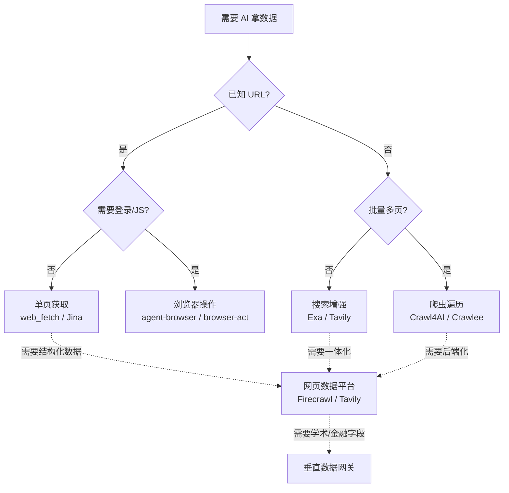

做 AI Agent 项目最大的坑不是 prompt，而是**怎么让 agent 拿到正确的数据**。同一个目标——"读完这篇文章"——用对的工具可能 200ms + 几美分，用错的工具可能 30 秒 + 几块钱。这篇是我整理的工具分类与决策框架。

## 一、六类工具，一句话区分

按"轻 → 重"排列，遇到问题逐级升级：

| 类别 | 解决什么 | 轻的代表 | 重的代表 |
|---|---|---|---|
| **单页获取** | 已知 URL，拿正文 | `web_fetch`、Jina Reader | — |
| **搜索增强** | 不知道 URL，先搜来源 | Exa Search、Tavily Search | 内置 web search |
| **浏览器操作** | 登录、点击、JS 渲染 | `agent-browser` | `browser-act`、Stagehand |
| **爬虫与遍历** | 从入口批量抓整站 | Crawl4AI、Crawlee | AnyCrawl |
| **网页数据平台** | search+scrape+crawl 统一 API | Tavily | Firecrawl |
| **垂直数据网关** | 不抓网页，直接接结构化数据 | 学术 / 金融 / 企业 API SDK | `agent-gw` 类聚合 |

核心原则：**先用最轻的能力，只有不够时才升级**。90% 的需求 `web_fetch` + Exa/Tavily 就能解决，剩下 10% 才是爬虫和浏览器的战场。

## 二、决策流程图

## 三、关键工具横评

### 3.1 单页获取（最轻）

| 工具 | 强项 | 弱项 |
|---|---|---|
| `web_fetch` | 最快、最便宜 | 不处理复杂前端 |
| Jina Reader | 极简 URL→文本 | 不是完整搜索体系 |
| Tavily Extract | 跟 Tavily 工作流串联 | 偏平台化 |

### 3.2 浏览器操作（最重）

| 工具 | 控制对象 | 何时选 |
|---|---|---|
| Kimi WebBridge | **你真实的浏览器** | 你已经登录、想复用状态 |
| `agent-browser` | 自动化 Chromium | 标准点击 / 输入 / 截图 |
| `browser-act` | 自起浏览器 + 直连 Chrome | stealth / 代理 / 验证码 |
| `browser-use` | 浏览器 agent 框架 | 让 LLM 自主操作网站 |
| Stagehand | Browserbase SDK | 嵌入产品 |

经验法则：**已登录** → Kimi WebBridge；**要自动化 + stealth** → `browser-act`；**给 agent 用** → `browser-use` / Stagehand。

### 3.3 爬虫与遍历

| 工具 | 生态 | 何时选 |
|---|---|---|
| Crawl4AI | Python | RAG 清洗、Markdown 抽取 |
| Crawlee | Node.js | 复杂调度 + 反爬 |
| ScrapeGraphAI | Python | AI 驱动结构化提取 |
| AnyCrawl | Node.js 服务化 | 团队共用抓取后端 |

### 3.4 网页数据平台（一体化）

| 工具 | 定位 | 何时选 |
|---|---|---|
| Tavily | Agent research API | search→extract→crawl 闭环 |
| Firecrawl | 完整数据平台 | search/scrape/crawl/interact 一体化 |
| AnyCrawl | 自托管抓取 | 想自己控数据 |

## 四、10 条默认推荐

没特殊约束时的选择顺序：

1. **已知 URL**：先试 `web_fetch`，不行再换 Jina
2. **查技术资料 / 英文**：Exa
3. **Agent 调研工作流**：Tavily（search→extract→crawl）
4. **登录态页面**：Kimi WebBridge（用你的真实浏览器）
5. **复杂自动化 / 反爬**：`browser-act`
6. **Python + RAG 清洗**：Crawl4AI
7. **Node.js 工程抓取**：Crawlee
8. **团队统一抓取后端**：AnyCrawl
9. **完整数据平台**：Firecrawl
10. **学术 / 金融 / 企业数据**：用垂直 API（`agent-gw` 这类）

## 五、值得关注的 7 个开源项目

- **Jina Reader** — 单页获取的事实标准，URL 一塞直接出 Markdown
- **Crawl4AI** — Python 生态首选，AI 友好（自动提取正文 + 结构化）
- **Firecrawl** — 完整平台化方案，自带 MCP server，agent 友好
- **Crawlee** — Apify 出品，Node.js 抓取框架，工业级稳定
- **browser-use** — 让 LLM 像人一样操作浏览器的开源框架
- **Exa** — 英文 AI 搜索引擎，技术资料召回率高于通用搜索
- **Tavily** — Agent research API，agent 圈的"默认搜索"

---

> **本文原则**：工具列表会过期，但分类不会。3 个月后可能多出 5 个新工具，但你仍然在 6 类里挑——这个框架长期有用。