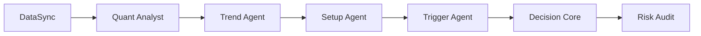

最近发现 [LLM-TradeBot](https://github.com/EthanAlgoX/LLM-TradeBot) 这个仓库有意思：用多个 LLM Agent 协作做加密货币超短线趋势跟踪，Kimi 官方预留接口。我把它跑通后整理了这篇配置笔记。

## 一、这个项目干什么

LLM-TradeBot 用 6 个 Agent 协作：



每个 Agent 负责一段：DataSync 拉数据、Quant Analyst 算指标、Trend 看方向、Setup 找入场、Trigger 出触发信号、Decision Core 综合决策、Risk Audit 否决权。

每小时自动跑一遍，适合追 1 小时级别的趋势，5 个币种轮动。

## 二、为什么选 Kimi

仓库原生预留了 `KIMI_API_KEY`（OpenAI 兼容格式）。中文语料训练、1 小时级别的金融话术更地道，单次成本约 0.006 元/千 token。一次完整决策调用约 500 token，**5 币种每小时约 0.15 元**。

备选 LLM：DeepSeek（便宜但中文一般）、Qwen（中文好但推理慢）、Claude/GPT-（贵且封号风险）。

## 四、环境要求

|  | 最小 | 推荐 |
|---|---|---|
| Python | 3.11+ | 3.12 |
| 内存 | 4 GB | 8 GB+ |
| 服务器位置 | 国内能访问外网 | 新加坡 / 东京（延迟 <50ms） |
| 交易所 | 币安 API Key + 合约权限 | + IP 白名单 |

## 五、三步启动

### 5.1 克隆 + 装依赖

```bash
git clone https://github.com/EthanAlgoX/LLM-TradeBot.git
cd LLM-TradeBot
chmod +x install.sh && ./install.sh
```

### 5.2 配 API Key

```bash
cp .env.example .env
vim .env
```

```bash
# LLM
LLM_PROVIDER=kimi
KIMI_API_KEY=sk-<你的Kimi API Key>
KIMI_MODEL=moonshot-v1-8k

# 币安
BINANCE_API_KEY=<你的币安 API Key>
BINANCE_SECRET=<你的 Secret>
BINANCE_DEFAULT_TYPE=swap  # U 本位永续

# 模式
TRADING_MODE=test   # 先 test 跑 3-5 天再上 live
```

**币安 API Key 必备权限**：读取 + 合约交易 + **IP 白名单**（填服务器 IP，**不绑会被风控**）。

### 5.3 启动测试模式

```bash
python simple_cli.py --mode continuous --interval 60
# 或 Web Dashboard
python main.py --test --mode continuous
# 访问 http://localhost:8000
```

测试模式用虚拟资金，**先跑 3-5 天**验证胜率再考虑上实盘。

## 六、关键策略 Prompt（节选）

LLM 的决策 prompt 设计是这个项目的核心。给一个例子——选股 prompt：

```text
你是加密货币超短线趋势跟踪专家。

当前时间：{current_time}

【做多候选池】24h 涨幅 Top 15：{long_candidates}
【做空候选池】24h 跌幅 Top 15：{short_candidates}
【已有持仓】{current_positions}
【冷却黑名单】30 分钟内不可入场的币种：{blacklist}

规则：
1. 只选近 1 小时波动 3%-10% 的币种（超 10% 观望）
2. 做多：1h EMA9 > EMA21, MACD > 0，近 1h 回调 3-5%
3. 做空：1h EMA9 < EMA21, MACD < 0，近 1h 反弹 2-3%
4. 同向持仓不再开
5. 最多推 3 个，没机会就推空
```

输出严格 JSON（`{recommendations, skip_list}`），方便程序解析。

Prompt 设计关键：**给约束给模板，少让 LLM 自由发挥**。金融市场容错率低，宁可模型保守。

## 七、风控参数

`config.yaml` 里的关键阈值（强烈建议先保守）：

```yaml
risk:
  stop_loss_pct: 0.04        # 4% 止损
  take_profit_pct: 0.20     # 20% 止盈
  max_hold_hours: 4           # 4 小时强制平仓
  total_daily_loss_pct: 0.30  # 日亏 30% 停

entry_filter:
  hourly_volatility_min: 0.03
  hourly_volatility_max: 0.10  # >10% 观望

funding:
  total_capital: 100       # 先充 100 USDT
  capital_per_symbol: 15
  trade_ratio: 0.75         # 75% 仓位
  leverage: 20              # 20 倍杠杆
```

## 八、成本估算（5 币种、1 小时周期）

| 项目 | 单价 | 日成本 |
|---|---|---|
| Kimi API | 0.006 元/千 token | ~0.15 元 |
| 币安开仓 Maker | 0.02% | ~0.15 USDT |
| 币安平仓 Taker | 0.05% | ~0.375 USDT |
| 资金费率（热点币） | 0.01-0.05%/8h | 0.05-0.25 USDT |
| **日合计** | - | **~0.6-0.8 USDT + 0.15 元** |

20% 止盈（赚 30 USDT）扣成本净赚 29.5，**成本占比 <2%**。

## 九、踩坑提醒

**别一上来就 live**：3-5 天测试模式没确认胜率之前不要充钱。

**Kimi 延迟**：高峰期 3-5 秒，但策略是 1 小时周期，影响不大。fallback 到本地规则：观望。

**币安限频**：5 币种 + 持仓 = 20-30 次/小时，远低于 API 上限（1200 次/分钟）。程序会自动 429 重试。

**全仓模式风险**：默认 cross（全仓），所有仓位共享保证金。**当日亏 30% 自动停交易**，但 5 个币种同时反向波动 5% 就会快速侵蚀缓冲。

**资金费率陷阱**：做空热点币（TRUMP、PEPE）时资金费常为负（空头付多头），持仓超 2 小时要关注。`Agent Chatroom` 会显示当前费率。

## 十、启动清单

- [ ] 申请币安 API Key（开通合约权限 + IP 白名单）
- [ ] 申请 Kimi API Key（platform.moonshot.cn，充 10 元）
- [ ] Fork LLM-TradeBot 仓库
- [ ] `pip install -r requirements.txt`（或 `./install.sh`）
- [ ] 配置 `.env`（币安 API + Kimi API + `TRADING_MODE=test`）
- [ ] 配置 `config.yaml`（先保守参数）
- [ ] 在 Dashboard 填入策略 Prompt
- [ ] **测试模式跑 3-5 天**，观察胜率 >50%
- [ ] 改 `TRADING_MODE=live`，充 100 USDT
- [ ] 设置 Telegram 通知
- [ ] 每周导出日志调 Prompt

---

> **本文不构成投资建议**。量化交易有风险，配置前先在测试模式验证。AI Agent 的决策仍可能出错，风控参数是底线不是上限。