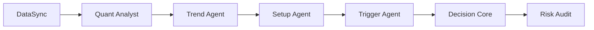

最近发现 [LLM-TradeBot](https://github.com/EthanAlgoX/LLM-TradeBot) 这个仓库有意思：用多个 LLM Agent 协作做加密货币超短线趋势跟踪，Kimi 官方预留接口。我把它跑通后整理了这篇配置笔记。

## 一、项目概览

| 属性 | 内容 |
|---|---|
| **GitHub** | [EthanAlgoX/LLM-TradeBot](https://github.com/EthanAlgoX/LLM-TradeBot) |
| **定位** | 多 Agent AI 量化交易系统，基于对抗决策框架 (ADF) |
| **核心优势** | AUTO1 自动选币、多时间框架对齐、多 Agent 协作、Dashboard 可视化 |
| **支持交易所** | 币安（现货/合约）、Bybit/OKX/Bitget (Coming Soon) |
| **支持 LLM** | DeepSeek、OpenAI、Claude、Qwen、Gemini、**Kimi**、MiniMax、GLM |
| **技术栈** | Python 3.11+、FastAPI、Docker |

### 6 个 Agent 分工



每个 Agent 负责一段：
- **DataSync**：拉取多时间框架（5m/15m/1h）数据
- **Quant Analyst**：计算指标（EMA/MACD/RSI/volume）
- **Trend Agent**：用 LLM 判断趋势方向
- **Setup Agent**：找入场时机
- **Trigger Agent**：出触发信号
- **Decision Core**：综合决策
- **Risk Audit**：一票否决高风险决策

### 为什么选 Kimi

- 仓库**原生预留 `KIMI_API_KEY`**（OpenAI 兼容格式）
- 中文语料训练、1 小时级别金融话术更地道
- 单次成本约 0.006 元/千 token（一次完整决策调用约 500 token，**5 币种每小时约 0.15 元**）

## 二、环境要求

| 项目 | 要求 |
|---|---|
| **Python** | 3.11+ |
| **内存** | 4 GB+ |
| **硬盘** | 10 GB+ |
| **网络** | 能访问币安 API 和 Kimi API |
| **服务器位置** | 建议新加坡/东京（AWS/阿里云），延迟 <50ms |

## 三、安装步骤

### 方式 A：一键安装（推荐）

```bash
# 1. 克隆仓库
git clone https://github.com/EthanAlgoX/LLM-TradeBot.git
cd LLM-TradeBot

# 2. 一键安装（自动检查 Python/Docker，装依赖）
chmod +x install.sh
./install.sh

# 3. 配置 API Key
vim .env

# 4. 启动
./start.sh
```

访问 Dashboard：`http://localhost:8000`

### 方式 B：Docker 部署（生产环境）

```bash
# 1. 克隆仓库
git clone https://github.com/EthanAlgoX/LLM-TradeBot.git
cd LLM-TradeBot

# 2. 配置环境
cp .env.example .env
vim .env  # 填入 API Key

# 3. Docker 启动
cd docker
docker-compose up -d
```

### 方式 C：手动安装

```bash
# 1. 克隆仓库
git clone https://github.com/EthanAlgoX/LLM-TradeBot.git
cd LLM-TradeBot

# 2. 创建虚拟环境
python -m venv venv
source venv/bin/activate  # Linux/Mac
# 或 venv\Scripts\activate  # Windows

# 3. 安装依赖
pip install -r requirements.txt

# 4. 配置环境变量
cp .env.example .env
vim .env

# 5. 启动测试模式
python main.py --test --mode continuous
```

## 四、API Key 申请

### 4.1 币安 API Key

1. 登录 [binance.com](https://www.binance.com)
2. 右上角头像 → **API 管理**
3. 创建新 API Key
4. **必须开通的权限**：
   - ✅ 读取（Read）
   - ✅ 合约交易（Futures Trading）
   - ✅ **启用 IP 白名单**（填入你的服务器 IP，**不绑会被风控**）
5. 保存 `API Key` 和 `Secret Key`

### 4.2 Kimi API Key

1. 访问 [platform.moonshot.cn](https://platform.moonshot.cn)
2. 注册账号，完成实名认证
3. 创建 API Key
4. 充值（10 元够用很久）
5. 保存 `API Key`

**Kimi 模型选择**：

| 模型 | 上下文 | 价格 | 适用 |
|---|---|---|---|
| `moonshot-v1-8k` | 8K | 0.006 元/千 token | 本策略（每小时 1 次，5 币种） |
| `moonshot-v1-32k` | 32K | 0.012 元/千 token | 长历史数据场景 |
| `moonshot-v1-128k` | 128K | 0.06 元/千 token | 不推荐，贵且没必要 |

## 五、配置文件详解

### 5.1 `.env` 环境变量

```bash
# ==========================================
# LLM 配置（Kimi）
# ==========================================
LLM_PROVIDER=kimi
KIMI_API_KEY=sk-<你的KimiAPIKey>
KIMI_MODEL=moonshot-v1-8k

# 备选：如果 Kimi 有问题，可切换到 DeepSeek
# LLM_PROVIDER=deepseek
# DEEPSEEK_API_KEY=sk-<你的DeepSeekKey>
# DEEPSEEK_MODEL=deepseek-chat

# ==========================================
# 币安交易所配置
# ==========================================
BINANCE_API_KEY=<你的币安APIKey>
BINANCE_SECRET=<你的Secret>

# 默认交易类型：swap = U 本位永续合约
BINANCE_DEFAULT_TYPE=swap

# 交易对（AUTO1 = 自动选币，或手动指定如 BTCUSDT,ETHUSDT）
TRADING_SYMBOLS=AUTO1

# ==========================================
# 交易模式
# ==========================================
# test = 测试模式（虚拟资金，不执行真实交易）
# live = 实盘模式（真金白银）
TRADING_MODE=test

# ==========================================
# 通知（可选）
# ==========================================
# TELEGRAM_BOT_TOKEN=<你的TelegramBotToken>
# TELEGRAM_CHAT_ID=<你的ChatID>
```

### 5.2 `config.yaml` 策略配置

```yaml
# ==========================================
# 资金结构
# ==========================================
funding:
  total_capital: 100          # 总充值 100 USDT（建议）
  symbols_count: 5            # 同时最多 5 个币种
  capital_per_symbol: 15      # 每币种分配 15 USDT
  trade_ratio: 0.75          # 交易资金 75% 开仓（7.5 USDT 保证金）
  margin_buffer: 5            # 备用 5 USDT（在 15 里面）

# ==========================================
# 杠杆与合约
# ==========================================
leverage:
  default: 20                 # 默认 20 倍杠杆
  mode: cross                # 全仓模式（cross = 全仓，isolated = 逐仓）

# ==========================================
# 风控参数
# ==========================================
risk:
  stop_loss_pct: 0.04         # 4% 止损
  take_profit_pct: 0.20      # 20% 止盈
  max_hold_hours: 4           # 4 小时强制平仓
  total_daily_loss_pct: 0.30  # 当日总亏损 30% 停止交易

# ==========================================
# 入场过滤
# ==========================================
entry_filter:
  hourly_volatility_min: 0.03  # 近 1 小时波动最低 3%
  hourly_volatility_max: 0.10  # 近 1 小时波动最高 10%，超 10% 观望

# ==========================================
# 反手策略
# ==========================================
reverse:
  enabled: true               # 启用反手
  cooldown_minutes: 30          # 止损后冷却 30 分钟
  max_reverse_per_day: 2       # 同一币种日反手上限 2 次

# ==========================================
# 执行参数
# ==========================================
execution:
  open_order_type: limit        # 限价单开仓（Maker 0.02%）
  close_order_type: market     # 市价单平仓（Taker 0.05%）
  limit_price_offset: 0.001    # 限价单偏移 0.1%（确保成交）

# ==========================================
# 周期设置
# ==========================================
cycle:
  interval: 60                  # 60 分钟 = 1 小时扫描一次
  timeframe: 1h                 # 1 小时 K 线

# ==========================================
# 多 Agent 配置
# ==========================================
agents:
  symbol_selector:
    enabled: true
    mode: auto1               # AUTO1 自动选币
    top_n: 15                 # 涨幅/跌幅 Top 15

  data_sync:
    enabled: true
    timeframes: [5m, 15m, 1h]

  quant_analyst:
    enabled: true
    indicators: [ema, macd, rsi, volume]

  trend_agent:
    enabled: true
    llm: true

  setup_agent:
    enabled: true
    llm: true

  trigger_agent:
    enabled: true
    llm: true

  decision_core:
    enabled: true
    min_confidence: 7           # 置信度 >= 7 才执行

  risk_audit:
    enabled: true
    veto_enabled: true
```

## 六、关键策略 Prompt

### 6.1 选股 Prompt（每小时执行）

```text
你是加密货币超短线趋势跟踪专家，擅长判断 1 小时级别的趋势延续性。

当前时间：{current_time}

【做多候选池】（24h 涨幅 Top 15）
{long_candidates}

【做空候选池】（24h 跌幅 Top 15）
{short_candidates}

【已有持仓币种】（不可再开同向）
{current_positions}

【冷却黑名单】（30 分钟内不可入场）
{blacklist}

策略规则：
1. 只选近 1 小时波动在 3%-10% 的币种（超过 10% 观望，不入场）
2. 做多要求：1 小时 EMA9>EMA21，MACD>0，近 1 小时回调 3-5%
3. 做空要求：1 小时 EMA9<EMA21，MACD<0，近 1 小时反弹 2-3%
4. 已有持仓的币种不可再开同向（已开多则不选做多）
5. 黑名单币种不选
6. 最多推荐 3 个币种，没有好机会则推荐空列表

输出严格 JSON 格式：
{
  "recommendations": [
    {
      "symbol": "TRUMPUSDT",
      "direction": "LONG",
      "confidence": 8,
      "reason": "小时趋势向上，近 1 小时回调 4% 后企稳，EMA 金叉"
    }
  ],
  "skip_list": ["PEPEUSDT"],
  "skip_reason": "近 1 小时波动 12%，超过 10% 阈值，观望"
}
```

### 6.2 持仓决策 Prompt

```text
你是加密货币持仓管理专家，判断当前仓位该持有、止盈续持、还是止损反手。

币种：{symbol}
方向：{position_side}
入场价：{entry_price}
当前价：{current_price}
持仓时间：{hold_hours} 小时
当前盈亏：{pnl_pct}%

小时趋势指标：
- EMA9：{ema9}
- EMA21：{ema21}
- MACD：{macd}
- MACD 柱状图：{macd_hist}
- RSI(14)：{rsi}
- 近 1 小时波动：{hourly_volatility}%

策略规则：
1. 做多盈利 20% 或做空盈利 20% → 触发止盈，评估是否续持（移动止盈到成本价+10%）
2. 做多亏损 4% 或做空亏损 4% → 触发止损，建议反手方向
3. 持仓满 4 小时 → 强制平仓
4. 小时趋势逆转 → 提前平仓
5. 近 1 小时波动>10% → 观望，不续持

输出严格 JSON 格式：
{
  "action": "HOLD / TAKE_PROFIT / STOP_LOSS / TIME_CLOSE / REVERSE",
  "confidence": 8,
  "reason": "小时趋势仍向上，建议继续持有",
  "reverse_direction": "SHORT",
  "reverse_confidence": 7
}
```

**关键 Prompt 设计原则**：

- **给约束给模板**，少让 LLM 自由发挥
- **JSON 输出严格**，方便程序解析
- **占位符清晰**（`{current_time}` 等），程序自动替换
- **关键数字用阈值**（波动 3%-10%、EMA 金叉死叉、RSI > 70 超买）

## 七、成本估算

| 项目 | 单价 | 日成本（5 币种） |
|---|---|---|
| Kimi API | 0.006 元/千 tokens | 约 0.15 元 |
| 币安开仓（Maker 0.02%） | 150 × 0.02% = 0.03 USDT | 约 0.15 USDT |
| 币安平仓（Taker 0.05%） | 150 × 0.05% = 0.075 USDT | 约 0.375 USDT |
| 资金费率（热点币） | 0.01-0.05%/8h | 约 0.05-0.25 USDT |
| **日合计** | - | **约 0.6-0.8 USDT + 0.15 元** |

**20% 止盈（赚 30 USDT）扣除成本后净赚约 29.5 USDT，成本占比 <2%**。

## 八、踩坑提醒

### 8.1 别一上来就 live

3-5 天测试模式没确认胜率之前不要充钱。**至少 3 天模测 + 胜率 >50%**。

### 8.2 Kimi API 延迟

高峰期 3-5 秒，但策略是 1 小时周期，影响不大。fallback 到本地规则：观望或持有。建议同时申请 DeepSeek API 作为备用。

### 8.3 币安 API 限频

每小时扫描 5 个币种 + 持仓管理，请求量不大。如果同时持仓 5 个，每小时约 20-30 次 API 调用，远低于币安限频。如有 429 错误，程序会自动等待重试。

### 8.4 全仓模式风险

默认 cross（全仓），所有仓位共享保证金池。**当日总亏达 30%（22.5 USDT）时，程序自动停止交易**。但 5 个币种同时反向波动 5% 就会快速侵蚀缓冲。

### 8.5 资金费率陷阱

做空热点币（TRUMP、PEPE）时资金费常为负（空头付多头），持仓超 2 小时要关注。`Agent Chatroom` 会显示当前资金费率。

### 8.6 服务器要求

必须 24h 运行，建议用云服务器（AWS/阿里云/腾讯云）。推荐新加坡/东京节点，延迟 <50ms。国内服务器需确认能访问币安 API（可能需要代理）。

## 九、启动清单

- [ ] 申请币安 API Key（开通合约权限，绑定 IP）
- [ ] 申请 Kimi API Key（platform.moonshot.cn，充 10 元）
- [ ] Fork LLM-TradeBot 仓库
- [ ] `./install.sh`（或 `pip install -r requirements.txt`）
- [ ] 配置 `.env`（币安 API + Kimi API）
- [ ] 配置 `config.yaml`（先保守参数）
- [ ] Dashboard 填入策略 Prompt
- [ ] **测试模式跑 3-5 天**，观察胜率 >50%
- [ ] 验证 Kimi 输出正常
- [ ] 改 `.env` 为 `TRADING_MODE=live`
- [ ] **充值 100 USDT**，启动实盘
- [ ] 设置 Telegram 通知（可选）
- [ ] 每周导出交易日志调 Prompt

## 十、下一步

1. 申请 API Key（币安 + Kimi，约 10 分钟）
2. Fork 仓库，按本指南配置
3. **跑测试网 3 天**，把 Agent Chatroom 截图发回
4. 帮你优化 Prompt，提高胜率
5. 充值 100 USDT，上实盘

---

> **本文不构成投资建议**。量化交易有风险，配置前先在测试模式验证。AI Agent 的决策仍可能出错，**风控参数是底线不是上限**。