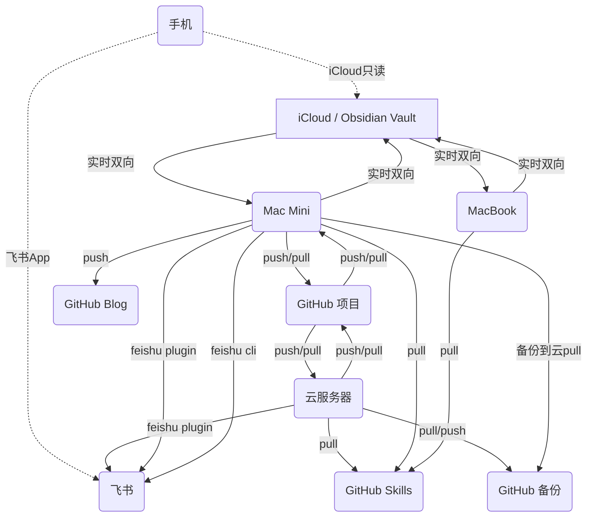

最近在整理个人知识库的时候发现一个老问题：**Obsidian vault 横跨 4 个终端（云服务器、Mac Mini、MacBook、手机），但每个端的同步方式都不一样**，改一处要担心其他端能不能跟上。本文是我折腾完之后的协同方案——核心目标是「一处修改、多处生效」，让笔记、Agent 配置、Skills、飞书知识库在不同设备之间形成可预期的链路。

## 一、协同资产一览

先把要协同的资产摊开看：

| 资产 | 存储位置 | 同步方式 |
|------|----------|----------|
| Obsidian 笔记 | iCloud Drive + GitHub 备份 | Mac 间 iCloud 实时；云服务器通过 GitHub 拉取 |
| Agent 配置 (`config.yaml` / `.env`) | vault 内的 `hermes/core/` 等子目录 | 跟随 Obsidian iCloud；`.env` 需手动 |
| Skills | GitHub 独立仓库 | 各端 `git pull` + cron 定期 |
| 飞书知识库 | 飞书 Cloud | 云服务器 / Mac Mini 通过 plugin 同步 |
| Coding 项目 | GitHub repo | git push/pull 协同 |

## 二、数据流图

下面这张图把跨端数据流画出来——实心箭头是双向同步，虚线是只读或弱同步。

几个关键流：

1. **Obsidian 笔记**：Mac Mini ↔ MacBook 通过 iCloud 实时双向。云服务器无 iCloud，靠 GitHub 备份仓库间接同步——Mac 端 `git push` 备份，云服务器 `git pull` 拉取。
2. **Skills**：独立 GitHub 仓库，各端 `git clone` 初始化、`git pull` 更新，靠 cron job 兜底。
3. **飞书知识库**：云服务器和 Mac Mini 通过 feishu plugin 定时把整理结果推送到飞书；手机直接用飞书 App 消费。
4. **Agent 配置**：Hermes 等 Agent 的配置放在 vault 内 `hermes/core/` 等子目录，跟 Obsidian 一起走 iCloud。`.env` 由人手动维护——**禁止 Agent 自动读写**。

## 三、同步链路速查表

| 链路 | 方式 | 实时性 | 说明 |
|------|------|--------|------|
| Obsidian 笔记（Mac 间） | iCloud Drive | 秒级 | Apple 原生，零运维 |
| Obsidian 笔记（云服务器） | GitHub 备份 | 定时 | Mac 端 push → 云端 pull，需 cron 驱动 |
| Skills 仓库 | GitHub | 定时 pull | 各端独立 pull，cron 确保版本一致 |
| Obsidian → 飞书知识库 | feishu plugin | 定时 | 处理结果由云端或 Mac Mini 推送 |
| Coding 项目 | GitHub | 手动 | 各端独立 push/pull |
| Agent 配置（`.env`） | 手动 | — | **用户亲自维护**，Agent 不碰 |

## 四、自动化建议

### 4.1 立即可行

- **Skills 自动同步**：各端加 cron job，每 2 小时 `git pull` skills 仓库
- **GitHub 日常 git 操作**：用 Agent cron job 自动跑 `git pull --rebase` → `git add -A` → `git commit -m "auto"` → `git push`
- **Obsidian Git 备份（云服务器）**：cron 定时从 GitHub 备份仓库 `git pull` 拉取最新 vault

### 4.2 建议实施

- **Agent 配置热同步**：`config.yaml` 随 Obsidian 同步后，cron 检测文件变更自动 `hermes config reload`
- **飞书知识库自动写入**：把研究、整理、日报等按固定模板定时写入
- **Blog 自动发布**：blog 目录变更后自动 commit → push → GitHub Pages deploy

### 4.3 可选优化

- **统一模型配置表**：把所有模型选择集中到 `models.yaml`，cron 分发到各端
- **飞书通知**：同步冲突、失败时通过飞书 bot 推送

## 五、典型工作流示例

### 5.1 研究类工作流

1. 在 Mac Mini 或 MacBook 检索资料、整理内容，先写进 Obsidian Wiki
2. 要归档到团队侧或移动端查看时，由 feishu plugin 把整理结果写入飞书知识库
3. 手机端主要用飞书 App 消费，Obsidian App 做只读查看

### 5.2 项目类工作流

1. 在 Mac Mini / 云服务器做 coding 或 multi-agent coding
2. 代码通过 GitHub repo 协同（push/pull）
3. 补项目方法论、故障记录、方案说明时再回写 Obsidian Wiki

### 5.3 配置类工作流

1. `config.yaml` 的结构化配置纳入 Wiki + GitHub 备份链路
2. `.env` 由用户亲自修改，Agent 不自动读写
3. 配置变更后各端 pull/sync，确保运行端与知识库一致

---

## 六、各端当前实际配置（脱敏版）

### 6.1 云服务器

- **Agent**：openclaw（multi agent）、hermes
- **IM 接入**：飞书、钉钉
- **功能**：24h agent 服务 / multi-agent coding / research / cron / 知识库维护
- **协同链路**：GitHub 仓库（skills 仓库 + Obsidian 备份）
- **模型分工**：research / review 用 deepseek 系，coding 用 doubao-seed-code，debug 用 glm，monitor / cron 用 minimax-2.7

### 6.2 Mac Mini（主力开发机）

- **Agent**：claude code / codex / minimax claw / kimi claw / openclaw / hermes
- **功能**：模型研究 / multi-agent coding / research / GitHub cron / blog 维护 / 飞书知识库
- **协同链路**：iCloud（Obsidian）+ GitHub 仓库 + feishu plugin
- **模型分工**：research 用 deepseek，coding 用 Claude Opus，debug 用 gpt-5.5，monitor/cron 用 minimax-2.7

### 6.3 MacBook（移动场景）

- **Agent**：kimi claw / hermes
- **功能**：research / blog 维护 / 飞书知识库
- **协同链路**：iCloud（只读为主）+ GitHub
- **特点**：大部分操作回 Mac Mini 做，MacBook 主要消费内容

### 6.4 手机

- **IM 接入**：飞书 App / 钉钉 App
- **功能**：模型研究 / research / 飞书维护
- **协同链路**：Obsidian App（只读）+ 飞书 App（消费为主）

---

## 七、待办 / 后续

- 把"模型配置是否合理"做一次完整 review，看哪些端用错模型、哪些冗余
- 验证多端 iCloud 冲突场景（同时编辑同一篇笔记）
- 把 cron job 配置集中到一个 `cron/` 目录作为单一来源
- 评估要不要从 iCloud 切到 Synology / 自建 NAS（隐私 + 容量）

> **隐私说明**：本文涉及的本地路径、`.env` 具体内容、Agent 真实账号已全部脱敏，仅保留架构与同步链路层面的描述。vault 根目录用「Mac 主机的 iCloud Drive 子目录」概括，不暴露实际路径。