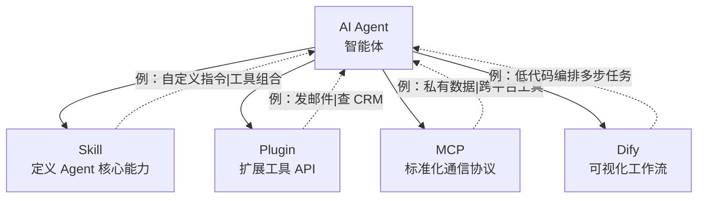

讲 AI Agent 工具时，**Skill / Plugin / MCP / Dify** 四个概念经常被混着用。这篇是给宁波本地 AI 知识工坊做的技术科普，用图 + 表说清楚四者的边界，附宁波场景推荐组合。

## 一、四者的位置



一句话区分：
- **Skill**：教 Agent **怎么想**（指令 / 工作流定义）
- **Plugin**：给 Agent **新工具**（API 封装）
- **MCP**：让 Agent **能接任何外部服务**（统一协议）
- **Dify**：**可视化搭** Agent（拖拽编排）

## 二、横向对比

| 维度 | Dify | MCP | Plugin | Skill |
|---|---|---|---|---|
| **定位** | 可视化工作流编排 | 模型↔工具通信协议 | 工具 API 扩展 | Agent 能力模块 |
| **部署** | 自托管（Docker）/ 云服务 | 本地/私有 Server | 各平台独立 | 依赖具体 Agent |
| **开发门槛** | 低（拖拽+配置） | 中（需要写代码） | 高（API开发+注册） | 中（定义Instruction） |
| **适用场景** | 企业知识库、客服 Bot、工作流自动化 | 开发者工具链、代码自动化、私有数据集成 | 商业 API 接入、第三方服务集成 | 企业专属 Agent 定制 |
| **代表平台** | Dify 官方 / Coze / 阿里云百炼 | Claude CodeX / Cursor / OpenClaw | OpenAI Plugins / Coze 插件 | OpenClaw / Coze / GPTs |
| **宁波落地优先级** | ★★★（制造业知识库） | ★★（开发者/自动化场景） | ★★（电商/外贸 API 集成） | ★★★（企业 Agent 定制） |

## 三、每个概念的详细说明

### 3.1 Dify：可视化工作流编排

Dify 是开源 LLM 应用开发平台，**拖拽式搭 Agent**。核心特点：

- **工作流编排**：可视化画流程图（开始 → LLM 调用 → 条件判断 → 工具调用 → 结束）
- **知识库管理**：上传文档自动向量化，RAG 检索
- **多模型支持**：GPT / Claude / 国内模型都支持
- **API 化**：搭完直接生成 OpenAI 兼容的 API

```bash
# 部署 Dify（docker-compose）
git clone https://github.com/langgenius/dify.git
cd dify/docker
docker compose up -d
# 访问 http://localhost/install
```

```yaml
# 工作流示例：客服自动回复
name: customer-service
nodes:
  - id: start
    type: start
  - id: classify
    type: llm
    prompt: "判断用户问题属于：售前/售后/投诉/其他"
  - id: branch
    type: if-else
    conditions:
      - case: "售前"
        next: pre-sales
      - case: "售后"
        next: after-sales
  - id: pre-sales
    type: knowledge-retrieval
    dataset: "product-docs"
```

### 3.2 MCP：标准化通信协议

MCP（Model Context Protocol）是 Anthropic 提出的**模型↔工具通信协议**。它解决的问题：

- 每个 Agent 自己实现工具调用（成本高）
- 工具作者要适配每个 Agent（生态割裂）
- MCP 统一协议后，**任何 Agent 支持 MCP 就自动能调用任何 MCP 工具**

```json
// MCP server 配置（mcp.json）
{
  "mcpServers": {
    "filesystem": {
      "command": "npx",
      "args": ["-y", "@modelcontextprotocol/server-filesystem", "/tmp"]
    },
    "github": {
      "command": "npx",
      "args": ["-y", "@modelcontextprotocol/server-github"],
      "env": { "GITHUB_TOKEN": "${GITHUB_TOKEN}" }
    },
    "postgres": {
      "command": "npx",
      "args": ["-y", "@modelcontextprotocol/server-postgres"],
      "env": { "DATABASE_URL": "${DATABASE_URL}" }
    }
  }
}
```

```python
# 自己写一个 MCP server
from mcp.server import Server, stdio

app = Server("my-tools")

@app.tool()
def add(a: int, b: int) -> int:
    """两个数相加"""
    return a + b

@app.tool()
def get_weather(city: str) -> str:
    """查天气"""
    return f"{city}：晴，25度"

if __name__ == "__main__":
    stdio.run_app(app)
```

启动后任何支持 MCP 的 Agent（Claude Code / Cursor / OpenClaw）都能调你写的工具。

### 3.3 Plugin：工具 API 扩展

Plugin 是**给 Agent 加新能力的预制包**。和 MCP 的区别：

- **Plugin**：平台特定（如 ChatGPT Plugin、Coze 插件、扣子插件）
- **MCP**：跨平台标准协议

```yaml
# Coze 插件示例
name: weather-plugin
description: 查天气
inputs:
  - name: city
    type: string
    required: true
api:
  url: "https://api.weather.com/v1/current"
  method: GET
  params:
    - key: city
      from: input.city
  response:
    temperature: "$.temperature"
    condition: "$.condition"
```

```js
// ChatGPT Plugin (OpenAPI 规范)
{
  "openapi": "3.0.0",
  "info": { "title": "My Plugin", "version": "1.0" },
  "paths": {
    "/weather": {
      "get": {
        "operationId": "getWeather",
        "parameters": [{ "name": "city", "in": "query" }]
      }
    }
  }
}
```

### 3.4 Skill：Agent 核心能力

Skill 是 **Agent 的"专业知识包"**——一组指令、工具、最佳实践的封装。

```yaml
# Claude Code Skill 示例（CLAUDE.md 或 .claude/skills/）
# Skill: code-reviewer
name: code-reviewer
description: 按团队规范审查代码
instructions: |
  审查代码时按以下顺序：
  1. 是否有安全漏洞（SQL 注入 / XSS / 鉴权绕过）
  2. 错误处理是否完整
  3. 是否有可读性问题（命名 / 注释 / 复杂度）
  4. 是否有性能瓶颈
  5. 测试覆盖是否足够
  
  每个问题给出具体行号 + 修改建议
tools:
  - read_file
  - run_lint
  - run_tests
```

```markdown
<!-- 简单的 Skill = Markdown prompt 模板 -->
# 角色：资深前端面试官

## 任务
针对候选人简历提出 5 个深度技术问题

## 约束
- 问题必须基于候选人简历内容
- 难度阶梯：基础 / 进阶 / 架构各 1-2 个
- 每个问题给参考答案
```

## 四、四个概念的关系

实际项目里这四者经常**叠加**用：

```text
Dify（工作流）
  ├─ Plugin 1：飞书通知
  ├─ Plugin 2：企业 CRM
  └─ LLM 节点
       └─ Skill：专业知识（如"金融风控规则"）
       
MCP（标准化）
  ├─ filesystem（读本地文件）
  ├─ github（操作 GitHub）
  └─ postgres（查数据库）
       └─ 与 Dify 互通（Dify 通过 MCP 调数据源）
```

**选型逻辑**：

```
要不要让 Agent 学会新思考？  → Skill
要不要给 Agent 新工具调用？  → Plugin
要不要接私有数据 / 跨平台？  → MCP
要不要非工程师也能搭？    → Dify
```

## 五、宁波场景下的工具组合

| 场景 | 推荐组合 | 理由 |
|---|---|---|
| **制造业企业知识库** | Dify（工作流）+ 钉钉插件 + 阿里云百炼（模型） | 本地部署数据安全，钉钉集成便于员工使用 |
| **外贸/跨境电商 Bot** | Coze/扣子（Plugin）+ 微信/企微 | 多平台接入，多语言支持 |
| **开发者本地自动化** | OpenClaw + MCP（filesystem/Git MCP） | 本地 Agent 编排，MCP 私有 Server 安全可控 |
| **高校科研场景** | Claude CodeX + MCP（arXiv/数据库） | 研究者专用，代码+文献综合能力 |
| **企业专属 Agent** | OpenClaw Skill 定制 + Dify 工作流 | 私有 Skill 定义+企业系统集成 |

**判断方法**：

```text
1. 业务侧用户多 → Dify 优先（低代码、非工程师能搭）
2. 开发者自己用 → MCP + 写 Skill（灵活、自动化深）
3. 要接 SaaS 平台（CRM / 工单）→ Plugin（最快）
4. 要私有知识 / 业务规则 → Skill（直接告诉 Agent 怎么做）
```

## 六、4 个工具实操安装

### 6.1 Dify

```bash
git clone https://github.com/langgenius/dify.git
cd dify/docker
cp .env.example .env
docker compose up -d
# 浏览器访问 http://localhost/install
```

### 6.2 MCP Server（自己写）

```bash
# 用 Python SDK
pip install mcp

# 装官方 example server
npx -y @modelcontextprotocol/server-filesystem /tmp

# 配置到 Claude Code
# ~/.config/claude/mcp.json
{
  "mcpServers": {
    "filesystem": {
      "command": "npx",
      "args": ["-y", "@modelcontextprotocol/server-filesystem", "/tmp"]
    }
  }
}
```

### 6.3 Coze 插件

```bash
# 字节扣子平台：https://www.coze.cn
# 1. 创建插件 → 2. 定义 API → 3. 关联 Bot → 4. 发布
# 全 GUI 操作，无需写代码
```

### 6.4 Claude Skill

```bash
# 在项目根创建 .claude/skills/ 目录
mkdir -p .claude/skills

# 写 skill
cat > .claude/skills/code-reviewer.md <<'EOF'
# Code Reviewer
审查代码时按以下顺序：
1. 安全漏洞
2. 错误处理
3. 可读性
4. 性能
5. 测试覆盖
EOF
```

## 七、5 个最易混的场景

### 7.1 「我要加个查天气功能」

```text
❌ 自己写 Skill：调 6 个 API 拼结果
✅ Plugin：装 OpenWeather 插件，0 行代码
```

### 7.2 「我要让 Agent 读我的 GitHub 仓库」

```text
❌ 写 Plugin：自己实现 GitHub API
✅ MCP：装 @modelcontextprotocol/server-github，配置 token
```

### 7.3 「我想让客服 Bot 知道我们公司的产品」

```text
❌ 写 Skill：把所有产品文档塞 prompt
✅ Dify 知识库：上传文档自动 RAG
```

### 7.4 「我想让销售部门自己改客服 Bot 的回答」

```text
❌ 写代码：让销售懂 prompt 不可能懂代码
✅ Dify：他们拖拽工作流、改 prompt 字符串
```

### 7.5 「我想做一个只服务我们公司的内部工具」

```text
❌ Plugin：发到公开市场没意义
✅ Skill：放在项目 .claude/skills/，团队用
```

## 八、4 个工具的演进方向

### 8.1 Dify：从工作流到 Agent 编排

未来 Dify 会**原生支持 MCP**（已经有 PR），形成"用 Dify 编排、用 MCP 连接工具"的完整链路。

### 8.2 MCP：从协议到生态

MCP 已经成事实标准（Anthropic、OpenAI、Google 都在用）。未来：
- **更多官方 server**（Slack、Notion、Linear、GitLab）
- **MCP 商店**——找 server 像找 npm 包
- **MCP Gateway**——企业内网聚合多个 server

### 8.3 Plugin：被 MCP 取代

传统 Plugin（平台特定）正在被 MCP 替代。预测：
- ChatGPT Plugin 在 2025 已被 OpenAI 弃用
- Coze 插件仍在用（字节生态）
- 未来 Plugin → MCP server 的迁移工具会增多

### 8.4 Skill：Agent 的"App Store"

Skill 是**最面向未来的概念**：
- Anthropic Skills、OpenAI GPTs、字节扣子 Skill 都是这方向
- 未来"卖 Skill"像卖 npm 包一样
- 跨平台 Skill（写一次多 Agent 用）是关键挑战

## 九、5 条实战建议

1. **从 Dify 开始**——可视化搭第一个 Agent 流程，1 小时上手
2. **MCP 用现成的**——别自己写，GitHub 有 100+ 官方 server
3. **Plugin 只在用 SaaS 时用**——自家系统走 MCP 更灵活
4. **Skill 沉淀**——团队的最佳实践固化成 Skill，新人 onboarding 提速
5. **关注 MCP 生态**——它是未来 2-3 年的核心标准

## 十、参考

- [modelcontextprotocol.io](https://modelcontextprotocol.io) — MCP 官方
- [dify.ai](https://dify.ai) — Dify 官方
- [coze.cn](https://www.coze.cn) — 字节扣子
- [docs.anthropic.com/mcp](https://docs.anthropic.com/en/docs/build-with-claude/mcp) — Claude MCP
- [github.com/modelcontextprotocol/servers](https://github.com/modelcontextprotocol/servers) — 官方 MCP server 列表
- [langgenius/dify](https://github.com/langgenius/dify) — Dify GitHub