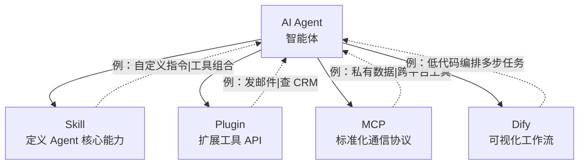

讲 AI Agent 工具时，**Skill / Plugin / MCP / Dify** 四个概念经常被混着用。这篇是给宁波本地 AI 知识工坊做的技术科普，用一张图 + 一张表说清楚四者的边界。

## 一、四者的位置



一句话区分：
- **Skill**：教 Agent **怎么想**（指令 / 工作流定义）
- **Plugin**：给 Agent **新工具**（API 封装）
- **MCP**：让 Agent **能接任何外部服务**（统一协议）
- **Dify**：**可视化搭** Agent（拖拽编排）

## 二、横向对比

| 维度 | Dify | MCP | Plugin | Skill |
|---|---|---|---|---|
| **定位** | 可视化工作流编排 | 模型↔工具通信协议 | 工具 API 扩展 | Agent 能力模块 |
| **部署** | 自托管（Docker）/ 云服务 | 本地 / 私有 Server | 各平台独立 | 依赖具体 Agent |
| **开发门槛** | 低（拖拽） | 中（写代码） | 高（API+注册） | 中（写指令） |
| **代表** | Dify 官方、Coze、阿里云百炼 | Claude Code、Cursor、OpenClaw | OpenAI Plugins、Coze 插件 | OpenClaw、Coze、GPTs |

## 三、宁波场景下的工具组合

| 场景 | 推荐组合 | 理由 |
|---|---|---|
| **制造业知识库** | Dify + 钉钉插件 + 阿里云百炼 | 本地部署数据安全 |
| **外贸/跨境电商 Bot** | Coze/扣子 + 微信/企微 | 多平台多语言 |
| **开发者本地自动化** | OpenClaw + MCP（filesystem / Git） | 私有 Server 安全 |
| **高校科研** | Claude Code + MCP（arXiv / 数据库） | 跨文献整合 |
| **企业专属 Agent** | OpenClaw Skill + Dify | 私有指令 + 系统集成 |

判断方法：

```
要不要让 Agent 学会新思考？  → Skill
要不要给 Agent 新工具调用？  → Plugin
要不要接私有数据 / 跨平台？  → MCP
要不要非工程师也能搭？    → Dify
```

四者经常**叠加**用——一个企业 Agent 通常同时有 Skill（业务指令）、Plugin（钉钉/邮件 API）、MCP（接内网数据库）、Dify（拖拽工作流）。选型不是非此即彼。