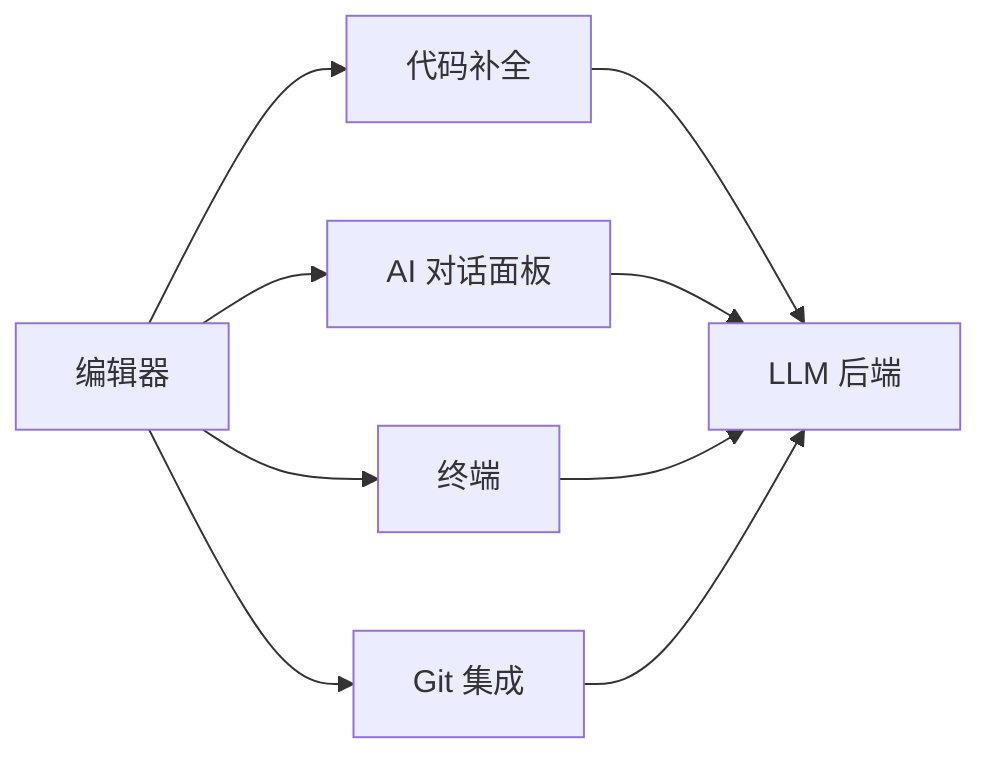

最近一个月主力用 Trae AI 做日常开发，从最初的"试用一下"到现在的"离不开"，踩过几个明显的坑。这篇把我的使用经验和踩坑记录整理出来，给考虑上手 Trae 的同学一个参考。

## 一、Trae AI 是什么

Trae AI 是字节出品的智能编程 IDE，把 AI 对话能力直接嵌进代码编辑器。和 GitHub Copilot 的补全模式不同，它把对话面板、终端、Git 都整合到一起，更像一个"AI 协作工作台"——你可以在同一个窗口里让 AI 写代码、看代码、改代码、跑测试。



四个面板共享同一份上下文，AI 知道当前选中什么、终端跑过什么命令、Git 改动了什么。这点比单点 AI 工具体验好很多。

## 二、快速上手

**安装**三步搞定：
- 官网（trae.cn）下载对应系统版本
- macOS 拖入 Applications、Windows 跑 .exe、Linux 解压跑 install.sh
- 启动后登录账号、选工作目录

**系统要求**（最小 vs 推荐）：

| 项 | 最小 | 推荐 |
|---|---|---|
| OS | Win10 / macOS 11 / Ubuntu 20.04 | Win11 / macOS 13 / Ubuntu 22.04 |
| 内存 | 8 GB | 16 GB+ |
| 磁盘 | 5 GB | 20 GB SSD |

低于最小配置会被卡在模型加载阶段（亲测 8GB 内存跑本地模型很吃力，建议直接用云端模型）。

## 三、五大核心功能用法

### 3.1 代码补全

按 Tab 接受建议，Esc 取消，Ctrl+Space 手动触发。和 VSCode 自带补全的区别：Trae 会基于**整个项目上下文**给建议，不只是当前文件。

### 3.2 AI 对话（最常用）

四个场景的 prompt 模板：

```text
生成代码：请写一个 Python 函数批量重命名图片为序号命名
解释代码：解释这段代码的算法和时间复杂度
优化代码：优化这段性能并加错误处理
修复 Bug：这段代码报 "TypeError: ...undefined"，帮我修
```

**经验**：把报错信息**完整贴上**比描述"它报错了"有效得多。AI 是模式匹配，不是心理医生。

### 3.3 代码解释

选中代码 → 右键"解释代码"。对读老代码（特别是别人的）特别有用——比从零读快 5 倍。

### 3.4 代码重构

自动识别重复代码块、嵌套 if-else、长函数，给出重构建议。**注意**：它会建议拆函数，但有时拆得过于细——结合自己的项目规范取舍。

### 3.5 终端 AI（意外好用）

终端输入 `??` + 自然语言，AI 自动生成 shell 命令：

```bash
?? 找当前目录下大于 100MB 的 log 文件
find . -name "*.log" -size +100M
```

省得去翻 stackoverflow 查命令参数。

## 四、四类常见问题

### 4.1 补全反应慢

按优先级排查：网络延迟 → 文件过大（> 2000 行建议拆分）→ 后台程序抢占 CPU → 设置里降低 AI 响应速度档。

### 4.2 AI 生成的代码有 bug

AI 输出**仅供参考**，必须做到：
1. 逐行读完理解再 copy
2. 测试环境跑过再上生产
3. 有疑问继续对话问 AI（它能解释自己写的代码）

### 4.3 隐私顾虑

- **本地模型版本**：全部在本地跑，不上传任何代码（需要 ≥16GB 内存）
- **云端版本**：只传当前编辑上下文，加密传输，**不存储**

团队用云端前最好先确认公司合规政策。

### 4.4 网络/模型加载失败

```bash
# 清理模型缓存重试
rm -rf ~/.trae/models/
# 看具体错误
cat ~/Library/Application\ Support/Trae/logs/ai-engine.log
```

90% 的加载失败是缓存文件损坏，删了重下就好。

## 五、三条高效使用建议

**分块迭代**：不要让 AI 一次写 500 行代码。拆成 5–10 个小函数，挨个让 AI 实现 + 测试，比一次性生成靠谱得多。

**先骨架后细节**：先生成函数签名 + docstring 框架，再让 AI 填实现。这样 AI 能聚焦、你也容易 review。

**配置 settings.json**：

```json
{
  "ai.completion.enabled": true,
  "ai.completion.maxLines": 10,
  "ai.conversation.contextLines": 50,
  "ai.model.temperature": 0.3,
  "editor.formatOnSave": true
}
```

`temperature: 0.3` 是代码生成的甜点值（默认 0.7 太发散）。

## 六、付费与替代

- 免费版：基础补全，每日次数限制
- Pro 版：¥29/月 或 ¥299/年，无限制 + 所有高级功能

值不值看使用强度。我一个月重度用下来 Pro 版的 ROI 明显——光解释老代码省的时间就够本了。替代方案对比 Cursor（功能更全但贵）、GitHub Copilot（补全更强但对话弱）、Codeium（免费但中文支持差）。

---

> **本文适用版本**：Trae AI v2.1+（截至 2026 年 8 月）。功能迭代快，部分细节可能过时，遇到问题以官方文档为准。