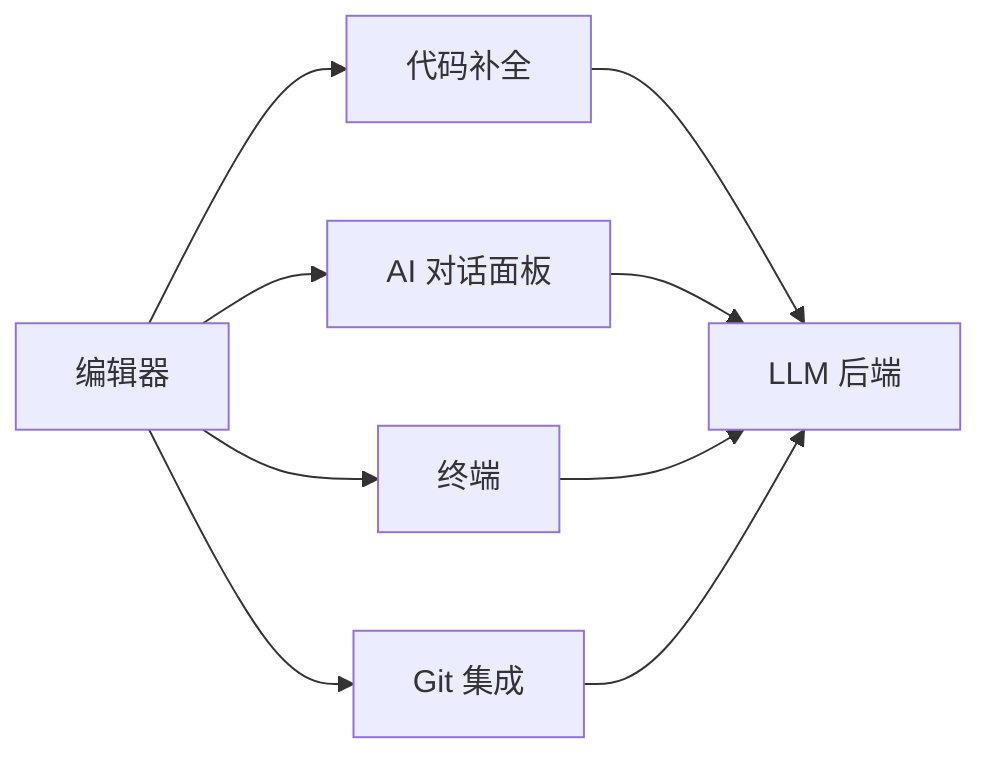

最近一个月主力用 Trae IDE 做日常开发，从最初的"试用一下"到现在的"离不开"，踩过几个明显的坑。这篇把使用经验系统整理出来，给考虑上手的工程师一个参考。

## 一、Trae AI 是什么

Trae AI 是字节跳动出品的智能编程 IDE，**把 AI 对话能力直接嵌进代码编辑器**。和 GitHub Copilot 的补全模式不同，它把对话面板、终端、Git 都整合到一起，更像一个"AI 协作工作台"——你在同一个窗口里让 AI 写代码、看代码、改代码、跑测试。



四个面板共享同一份上下文，AI 知道当前选中什么、终端跑过什么命令、Git 改动了什么。这点比单点 AI 工具体验好很多。

**支持的 LLM 后端**：DeepSeek、OpenAI、Claude、Qwen、Gemini、Kimi、MiniMax、GLM 等 8 个国内主流模型。

**支持的 IDE 功能**：自动补全、AI 对话、代码解释、bug 修复、代码重构、多语言支持（Python、JS、Java、Go、Rust 等）。

## 二、系统要求

|  | 最小 | 推荐 |
|---|---|---|
| 操作系统 | macOS 11+ / Win 10+ / Ubuntu 20.04+ | macOS 13+ / Win 11 / Ubuntu 22.04 |
| 内存 | 8 GB | 16 GB+ |
| 磁盘 | 5 GB | 20 GB SSD |
| 网络 | 稳定互联网 | 5 Mbps+ |

**低于最小配置**会被卡在模型加载阶段（亲测 8GB 内存跑本地模型很吃力，建议直接用云端模型）。

## 三、5 大核心功能详解

### 1. 代码补全

按 Tab 接受建议，Esc 取消，Ctrl+Space 手动触发。

和 VSCode 自带补全的**关键区别**：Trae 会基于**整个项目上下文**给建议，不只是当前文件。

**实测体感**：
- 写 React 组件时，能根据 props 类型推断正确写法
- 写 SQL 时，根据表名和字段名推荐 JOIN
- 写 Python 时，根据上下文推荐 import 顺序

**调优设置**：

```json
// settings.json
{
  "ai.completion.enabled": true,
  "ai.completion.triggerOnType": true,  // 输入时实时触发
  "ai.completion.maxLines": 10,        // 建议最多 10 行
  "ai.completion.debounceMs": 300      // 300ms 延迟避免抖动
}
```

### 2. AI 对话（最常用）

四个场景的 prompt 模板：

**生成代码**：

```text
请帮我写一个 Python 函数，用于批量重命名文件夹中的图片文件，按序号命名。要求：
- 支持自定义起始编号
- 处理中文文件名
- 跳过隐藏文件
- 返回重命名数量
```

**解释代码**：

```text
请解释这段代码的作用，包括：
1. 主要逻辑
2. 时间/空间复杂度
3. 潜在问题
4. 改进建议

[粘贴你的代码]
```

**优化代码**：

```text
请帮我优化这段性能并加错误处理：
- 把同步操作改异步
- 加 retry 机制（最多 3 次）
- 失败时记录日志
- 加类型注解

[粘贴你的代码]
```

**修复 Bug**：

```text
这段代码运行时报错 "TypeError: Cannot read property 'length' of undefined"，请帮我修复：
- 定位问题行
- 说明原因
- 给出修复版本
- 加防御性检查避免复发

[粘贴你的代码 + 完整错误堆栈]
```

**经验**：把**报错信息完整贴上**比描述"它报错了"有效得多。AI 是模式匹配，不是心理医生。

### 3. 代码解释

选中代码 → 右键"解释代码"或 `Ctrl+Shift+C`。

**对读老代码（特别是别人的）特别有用**——比从零读快 5 倍。

**典型场景**：
- 接手离职同事的项目
- 看 3 年前的祖传代码
- 读开源库源码

**解释深度调节**：

```text
// 简要说明
请用 3 句话解释这段代码

// 详细分析
请详细解释这段代码，包括：
- 每一行的作用
- 用到的设计模式
- 性能瓶颈
- 改进建议
```

### 4. 代码重构

自动识别重复代码块、嵌套 if-else、长函数，给出重构建议。

**注意**：它会建议拆函数，但有时拆得过于细——结合自己的项目规范取舍。

**实战例子**：把一个 200 行的 controller 拆成 5 个 service，AI 会在 30 秒内给出方案，自己手动调整依赖注入。

### 5. 终端 AI（意外好用）

终端输入 `??` + 自然语言，AI 自动生成 shell 命令：

```bash
?? 查找当前目录下大于 100MB 的 log 文件
find . -name "*.log" -size +100M

?? 查 8080 端口谁在用
lsof -i :8080

?? 看今天 nginx 错误日志
grep "$(date +%Y-%m-%d)" /var/log/nginx/error.log
```

**省得去翻 stackoverflow 查命令参数**。

**安全警告**：终端 AI 的命令**自动执行前会确认**（默认是 `n`），不要无脑回车。先看再执行，特别是 `rm` / `chmod` / `kill` 这类命令。

## 四、4 类常见问题

### 4.1 补全反应慢

按优先级排查：

```text
1. 网络延迟 → ping 一下 LLM 后端
2. 文件过大（> 2000 行）→ 拆分文件
3. 后台程序抢占 CPU → 关不必要的程序
4. 设置里降低 AI 响应速度档（快但建议少）
5. 切换 LLM（DeepSeek 比 Claude 便宜且快）
```

### 4.2 AI 生成的代码有 bug

AI 输出**仅供参考**，必须做到：

```text
1. 逐行读完理解再 copy
2. 测试环境跑过再上生产
3. 有疑问继续对话问 AI（它能解释自己写的代码）
4. 关键代码（支付、权限）必须人工 review
```

**血泪教训**：曾直接用 AI 生成的 SQL 有 N+1 查询问题，上线后数据库 CPU 100%，查了一下午才发现。**AI 不知道你的数据量级**。

### 4.3 隐私顾虑

- **本地模型版本**：全部在本地跑，不上传任何代码（需要 ≥16GB 内存 + 较新 CPU）
- **云端版本**：只传当前编辑上下文，加密传输，**不存储用户代码**

团队用云端前最好先确认公司合规政策。

**敏感代码处理**：

```text
请帮我写一个 [功能]，但不要上传到云端，告诉我大概思路就好
```

AI 会切换到本地模式或仅给伪代码。

### 4.4 网络/模型加载失败

```bash
# 清理模型缓存重试
rm -rf ~/.trae/models/

# 看具体错误
cat ~/Library/Application\ Support/Trae/logs/ai-engine.log
```

90% 的加载失败是缓存文件损坏，删了重下就好。

## 五、3 条高效使用建议

### 5.1 分块迭代

**不要让 AI 一次写 500 行代码**。拆成 5–10 个小函数，挨个让 AI 实现 + 测试，比一次性生成靠谱得多。

**示例**：开发一个用户管理 API

```text
# Step 1: 让 AI 写数据模型
请定义 User 模型，包含 id, name, email, created_at 字段

# Step 2: 让 AI 写创建用户
请实现 create_user 函数，参数是 name, email，返回 User 对象

# Step 3: 让 AI 写查询
请实现 get_user_by_id 函数，参数是 user_id

# Step 4-N: 继续分步
```

每步都能 review、测试，再走下一步。

### 5.2 先骨架后细节

先生成**函数签名 + docstring 框架**，再让 AI 填实现。这样 AI 能聚焦、你也容易 review。

```text
请先给这个模块设计接口（不写实现），包括：
- 函数签名
- 参数说明
- 返回值
- 异常情况

确认后再实现
```

### 5.3 配置 settings.json

```json
{
  "ai.completion.enabled": true,
  "ai.completion.maxLines": 10,
  "ai.conversation.contextLines": 50,
  "ai.model.temperature": 0.3,
  "editor.formatOnSave": true,
  "editor.wordWrap": "on"
}
```

`temperature: 0.3` 是代码生成的甜点值（默认 0.7 太发散）。`contextLines: 50` 让 AI 看到足够上下文但不过长。

## 六、付费与替代

### Trae Pro vs 免费

| 功能 | 免费版 | Pro（¥29/月 或 ¥299/年） |
|---|---|---|
| 基础代码补全 | 每日次数限制 | 无限制 |
| AI 对话 | 限速 | 无限制 |
| Claude / GPT 高级模型 | 不可用 | 可用 |
| 高级重构 / Bug 修复 | 限次数 | 无限制 |
| 团队协作 | 单机 | 团队版 |

**值不值看使用强度**。我一个月重度用下来 Pro 版的 ROI 明显——光解释老代码省的时间就够本了。

### Trae vs Cursor / Copilot / Codeium

| 工具 | 优势 | 劣势 | 价格 |
|---|---|---|---|
| **Trae** | 中文友好、Kimi 内置、字节系 | 海外用户少、生态小 | 免费 / Pro ¥29/月 |
| **Cursor** | 功能最全、AI 体验最好 | $20/月贵、国内访问慢 | $20/月 |
| **GitHub Copilot** | 补全最强、生态成熟 | 对话弱 | $10/月 |
| **Codeium** | 免费个人用、速度快 | 中文支持差 | 免费 |

**选择建议**：
- 中文项目、字节系技术栈 → Trae
- 英文项目、追求极致 AI 体验 → Cursor
- 已有 GitHub 生态、团队大 → Copilot
- 预算紧、个人用 → Codeium

## 七、Trae 适合谁

**适合**：
- 中文母语开发者
- 字节系生态（飞书 / 抖音 / 掘金）的用户
- 个人 / 小团队（不需要企业级 SSO）
- 经常写 JS / TS / Python / Vue / React

**不太适合**：
- 纯英文 / 海外团队
- 写底层 C / C++ / Rust（补全质量不如 Cursor）
- 需要严格审计（金融 / 医疗）
- 大企业（需要私有部署 / SSO / 审计日志）

## 八、5 条进阶小贴士

1. **保存常用 prompt 为 snippet**——重复劳动降到最低
2. **重要代码用 #important 标记**——AI 会优先保留
3. **commit message 让 AI 写**——`Ctrl+I` 一键生成
4. **多文件搜索让 AI 做**——比 grep 智能
5. **终端 ?? 偶尔用即可**——形成依赖会忘记基础命令

## 九、与同公司产品对比

字节系 AI 编程工具不只 Trae 一个：

- **Trae**：桌面 IDE，类似 Cursor
- **Coze / 扣子**：可视化 Agent 编排，类似 Dify
- **火山方舟 / 豆包**：LLM API 服务，类似 OpenAI
- **方舟 Coding SDK**：嵌入式代码补全，类似 Copilot 插件

**Trae 在字节系的位置**：消费级 AI 编程 IDE，主打个人和小团队。如果企业级需求（私有部署、SSO、审计），看火山方舟 + Coding SDK。

## 十、版本演进（2026）

Trae 还在快速迭代：

- **2026 Q1**：v1.0 发布，主打基础 IDE + AI 对话
- **2026 Q2**：v1.5，加入自定义 Skill 框架
- **2026 Q3**：v2.0，多 Agent 协作、Terminal AI 完善
- **2026 Q4**：v2.5，企业版（私有部署）

**跟着官方更新**——每 1-2 月一次 minor release，新功能值得尝鲜，但**别在生产项目激进升级**。

## 十一、参考

- [trae.cn](https://www.trae.cn) — 官网
- [trae.cn/docs](https://docs.trae.cn) — 官方文档
- [Cursor 官网](https://www.cursor.com) — 对比工具
- [GitHub Copilot](https://github.com/features/copilot) — 对比工具
- [Codeium](https://codeium.com) — 对比工具
- [Kimi 平台](https://platform.moonshot.cn) — 国产 LLM

## 十二、多文件重构实战

AI 写多文件时，**分文件让 AI 写比一次性给所有 context 强 10 倍**：

```text
# Step 1: 列接口
请描述 [模块名] 的接口设计：
- 需要哪些文件
- 每个文件的职责
- 文件之间的依赖关系
- 数据流向

# Step 2: 写类型定义（types.ts / index.ts）
请先实现 [模块名] 的类型定义文件

# Step 3: 写主逻辑（service.ts）
请基于 types 实现 [主功能] 服务

# Step 4: 写 API 路由（router.ts / controller.ts）
请基于 service 实现 HTTP 路由

# Step 5: 写测试（*.test.ts）
请为 [主功能] 写单元测试，覆盖主要场景
```

每步之间**等 AI 完成、跑测试**，再走下一步。**不要让 AI 一次写 5 个文件**——容易引入不必要复杂度。

## 十三、自定义 Skill 编写

Trae v1.5+ 支持自定义 Skill（类似 Agent 的"专属能力"）。一个 Skill = 一组 prompt 模板 + 工具调用。

```yaml
# my-project/.trae/skill/code-review.yaml
name: "项目代码审查"
description: "按团队规范审查代码"
prompts:
  - name: "review-style"
    content: |
      请按以下规范审查代码：
      - ESLint Airbnb 规范
      - 函数不超过 50 行
      - 命名用 camelCase
      - 注释率不低于 20%
  - name: "review-test"
    content: |
      请审查测试代码：
      - 覆盖率不低于 80%
      - 边界条件覆盖
      - mock 用得是否合理
tools:
  - name: "read_file"
  - name: "run_lint"
```

在 IDE 里 `@code-review` 就能调起。

**Skill vs 普通 prompt**：

| 维度 | 普通 Prompt | Skill |
|---|---|---|
| 复用 | 每次手输 | 一次配置 |
| 上下文 | 单次对话 | 跨项目 |
| 工具调用 | 无 | 可绑定工具 |
| 团队共享 | 困难 | 文件级 |

**项目级 Skill 放在** `.trae/skill/` 目录，提交 git 团队共享。

## 十四、调试工作流

**遇到复杂 bug**时的工作流：

```text
Step 1: 复现
请描述这个 bug 的完整复现步骤：
- 触发条件
- 预期行为
- 实际行为
- 错误堆栈

Step 2: 定位
请基于以下信息定位问题：
- 错误堆栈
- 相关代码
- 输入数据
定位到具体行号

Step 3: 分析
请分析这个 bug 的根因：
- 为什么会出现
- 是设计缺陷还是实现 bug
- 是否有其他类似问题

Step 4: 修复
请给出修复方案：
- 最小改动版本
- 完整重构版本
- 测试用例

Step 5: 验证
请写测试用例验证修复：
- 单元测试
- 边界条件
- 回归测试
```

每步都让 AI 输出**可粘贴的代码**或**具体命令**，不是抽象描述。

## 十五、Trae + Git 工作流

把 AI 和 Git 结合用：

### 智能 commit

```bash
git add -A
# 按 Cmd+I，AI 自动分析 diff 生成 commit message
# 例：feat: add user authentication with JWT
```

### 自动 PR 描述

在 GitHub PR 页面粘 diff 链接给 AI，让它生成 PR 描述：

```text
这是我的 PR diff：[链接]
请生成 PR 描述，包括：
- 改动概述
- 关键决策
- 测试覆盖
- 截图建议
```

### Code review 自动化

```text
# .github/workflows/trae-review.yml
name: AI Code Review
on: pull_request
jobs:
  review:
    runs-on: ubuntu-latest
    steps:
      - uses: actions/checkout@v4
      - uses: trae-ai/review-action@v1
        with:
          api-key: ${{ secrets.TRAE_API_KEY }}
```

## 十六、跨平台对比

Trae vs Cursor vs Copilot 在 5 个维度的对比：

| 维度 | Trae | Cursor | Copilot |
|---|---|---|---|
| 中文支持 | ⭐⭐⭐⭐⭐ | ⭐⭐⭐ | ⭐⭐ |
| AI 对话 | ⭐⭐⭐⭐ | ⭐⭐⭐⭐⭐ | ⭐⭐⭐ |
| 代码补全 | ⭐⭐⭐⭐ | ⭐⭐⭐⭐ | ⭐⭐⭐⭐⭐ |
| 终端 AI | ⭐⭐⭐⭐⭐ | ⭐⭐⭐⭐ | ⭐⭐ |
| 团队协作 | ⭐⭐⭐ | ⭐⭐⭐⭐ | ⭐⭐⭐⭐⭐ |
| 价格 | ¥29/月 | $20/月 | $10/月 |

**经验之谈**：
- 纯中文项目 → Trae（中文理解和飞书集成是优势）
- 英文 + 复杂项目 → Cursor（补全 + 重构最强）
- 已有 GitHub 生态 + 大团队 → Copilot（集成最广）
- 预算紧 → Trae 免费版（够用）

## 十七、未来 1-2 年的趋势

AI 编程工具接下来会怎么发展：

- **更强的多模态**：能看设计稿、读日志截图、理解架构图
- **团队级知识**：自动学习团队代码规范、业务术语
- **更深入的测试**：AI 自动写测试 + 自动跑测试 + 自动修测试
- **代码审查民主化**：新手也能写出生产级代码
- **AI Native 编程语言**：专为 AI 协作设计的语言可能涌现

**给工程师的建议**：
- 不要把 AI 当万能工具，**它是放大器**，放大你的能力或缺陷
- 基本功（算法、设计、调试）**永远不会过时**
- 学 1-2 个 AI 工具到精通，**比浅尝 5 个强**
- 持续关注 AI 编程进展，但**别被 FOMO 驱动**

**最后**：选工具是为了解决问题，不是为了追新。**先用起来**比选完美重要——今天就用 Trae 写一个真实功能，比纠结"Cursor 是不是更好"三个月强。

---

> **本文基于 Trae v2.1+**（2026 年 8 月）。功能迭代快，部分细节可能过时，遇到问题以官方文档为准。